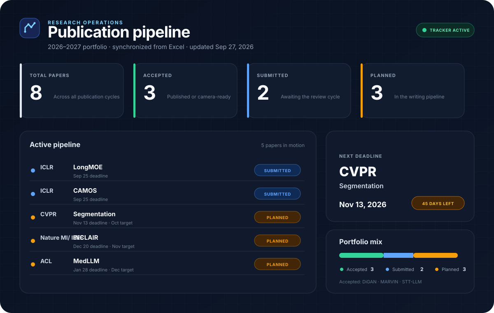

<div align="center">

# Publication Tracker

Research planning, submission, and outcomes are maintained in Excel and published automatically.

[**https://maxxrichard.github.io/Publication_Tracker/**]([data/publications.xlsx](https://maxxrichard.github.io/Publication_Tracker/)) 

</div>

<br>

<picture>
  
</picture>

## Interactive Dashboard

The repository root contains a responsive dashboard for GitHub Pages. It reads `data/publications.json`, which is generated from the Excel workbook whenever the site is deployed.

To publish it, open **Settings → Pages** in GitHub, choose **GitHub Actions** as the source, and run the **Deploy interactive dashboard** workflow. For a local preview, run `python3 -m http.server 8000` and open `http://localhost:8000`.

<details>
<summary><strong>Update from Excel</strong></summary>

<br>

1. Open [`data/publications.xlsx`](data/publications.xlsx) and edit the **Publications** sheet.
2. Keep one paper per row. Use the dropdowns for **Status**, **Priority**, and **Type**.
3. Run `python3 scripts/generate_readme.py` from the repository root.
4. Commit both the workbook and regenerated `README.md`.

Pushing a workbook change to the default branch also runs the included GitHub Action, which regenerates and commits the README automatically.

### Workbook Fields

| Field | Purpose |
|:--|:--|
| Publication Year | Conference or journal cycle used for README grouping |
| Venue / Type | Destination and publication category |
| Deadline | Sortable Excel date; use a full year |
| Paper Title | Working or final title |
| Status | Accepted, submitted, in review, revision, planned, on hold, withdrawn, or rejected |
| Target Month | Internal target for planned work |
| Priority / Owner | Accountability and planning |
| Next Step | The next concrete action |
| Paper URL | Optional public paper, preprint, or project link |
| Notes / Last Updated | Context and freshness |

> [!NOTE]
> Deadline years in the starter workbook were inferred from the supplied publication cycles: the 2026 accepted papers use 2025 deadlines; ICLR, CVPR, and Nature 2027 use 2026 deadlines; ACL 2027 uses a 2027 deadline. Verify these dates before relying on reminders.

### Repository layout

```text
data/publications.xlsx          Excel source of truth
data/publications.json          Generated browser-ready data
index.html                      Interactive GitHub Pages dashboard
assets/dashboard.css            Responsive light/dark design system
assets/dashboard.js             Filters, sorting, analytics, and details
assets/publication-dashboard.svg Generated visual dashboard
scripts/generate_readme.py      XLSX-to-Markdown generator (standard library only)
README.template.md              Human-editable README shell
README.md                       Generated tracker
.github/workflows/              Automatic README synchronization
```

</details>
