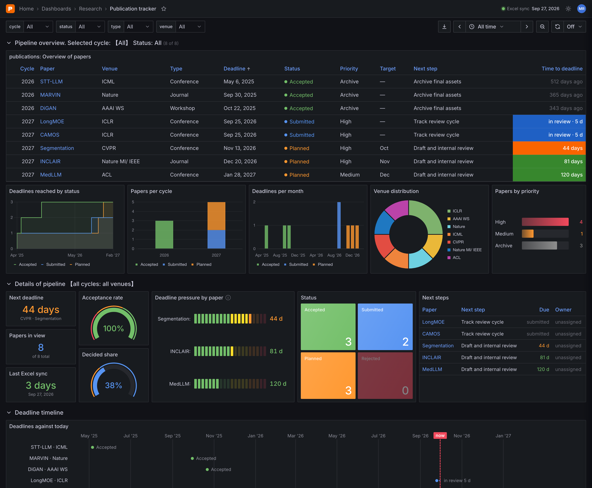

<div align="center">

# Publication Tracker

**A live dashboard for research submissions, deadlines, and outcomes, maintained in a single Excel workbook.**

[](https://maxxrichard.github.io/Publication_Tracker/)
[](https://github.com/maxxrichard/Publication_Tracker/actions/workflows/deploy.yml)

[**View the dashboard**](https://maxxrichard.github.io/Publication_Tracker/) · [Excel workbook](data/publications.xlsx) · [Updating the data](#updating-the-data)

</div>

<br>

<a href="https://maxxrichard.github.io/Publication_Tracker/">
  
</a>

## Portfolio snapshot

{{SUMMARY}}

## Overview

Publication Tracker turns a single spreadsheet into an interactive dashboard. The Excel workbook is the single source of truth. On every push, a GitHub Action converts it to JSON and redeploys the site to GitHub Pages, so no database or backend is needed.

### Dashboard features

| Area | What it provides |
|:--|:--|
| **Filters** | Filter every panel by cycle, status, type, and venue; the selection is kept in the URL so views can be shared |
| **Time range** | Deadline windows such as *next 6 months* or *last 12 months*, with pan and zoom controls |
| **Overview table** | Sortable list of all papers with color-coded time to deadline |
| **Charts** | Deadlines reached by status, papers per cycle, deadlines per month, venue mix, and priority breakdown; charts can be clicked to drill down |
| **Pipeline details** | Next deadline, acceptance rate, share of papers with a decision, deadline pressure per paper, status tiles, and next steps |
| **Timeline** | Every deadline plotted against today, including time spent in review |
| **Inspection** | Per-paper details and raw JSON, full-screen panel view, and CSV export |

The dashboard supports light and dark themes and works on desktop and mobile.

## Updating the data

1. Edit the **Publications** sheet in [`data/publications.xlsx`](data/publications.xlsx), one paper per row. Use the dropdowns for **Status**, **Priority**, and **Type**.
2. Commit and push the workbook to `main`.
3. The [deploy workflow](.github/workflows/deploy.yml) regenerates `data/publications.json` and this README, then publishes the dashboard.

To regenerate locally instead, run `python3 scripts/generate_readme.py` from the repository root.

<details>
<summary><strong>Workbook fields</strong></summary>

<br>

| Field | Purpose |
|:--|:--|
| Publication Year | Conference or journal cycle |
| Venue / Type | Destination and publication category (conference, journal, workshop) |
| Deadline | Submission deadline as an Excel date with a full year |
| Paper Title | Working or final title |
| Status | Accepted, Submitted, In Review, Revision, Planned, On Hold, Withdrawn, or Rejected |
| Target Month | Internal target for planned work |
| Priority / Owner | Planning and accountability |
| Next Step | The next concrete action |
| Paper URL | Optional link to the paper, preprint, or project page |
| Notes / Last Updated | Context and data freshness |

</details>

## Local development

The site is static HTML, CSS, and JavaScript. Serve the repository root and open <http://localhost:8000>:

```bash
python3 -m http.server 8000
```

Opening `index.html` directly from disk will not work, because the browser blocks loading `data/publications.json` from a file URL.

<details>
<summary><strong>Repository layout</strong></summary>

<br>

```text
index.html                    Dashboard page
assets/dashboard.css          Dashboard styles (dark and light themes)
assets/dashboard.js           Data loading, filters, charts, and panels
assets/dashboard-preview.png  Screenshot used in this README
data/publications.xlsx        Source of truth
data/publications.json        Generated data consumed by the dashboard
scripts/generate_readme.py    Excel → JSON and README generator (standard library only)
README.template.md            README source; edit this, not README.md
.github/workflows/deploy.yml  Regenerates data and deploys to GitHub Pages
```

</details>

> [!NOTE]
> `README.md` is generated from `README.template.md` on every deployment. Make README changes in the template, or they will be overwritten.

---

<sub>Maintained by Maxx Richard Rahman.</sub>
